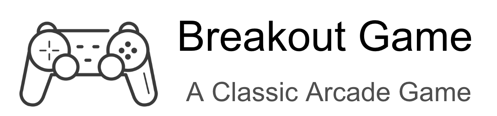
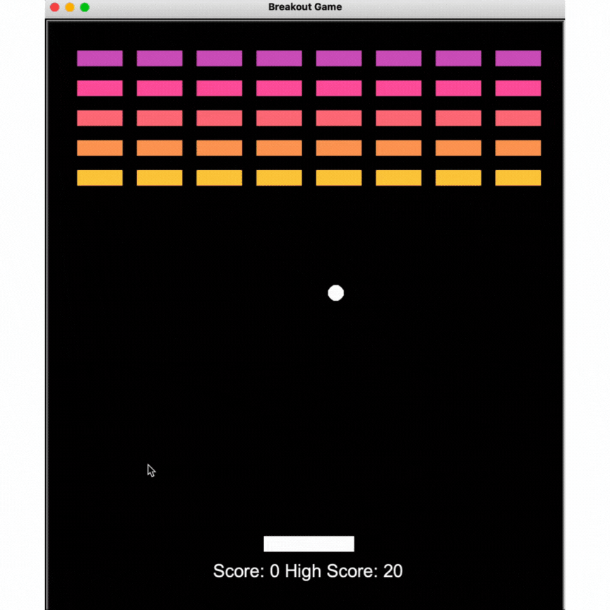

 
# Breakout Game
 
A Python one player game, based on object orientated programming with aim to remove a grid of "bricks" using a paddle and ball. 

## Screenshots

## Getting Started
 
Please clone the repository and run the `main.py` from the terminal to begin.

Move the paddle using the left and right arrow keyboard keys to bounce the ball into the coloured bricks and score points. 

The game ends when the bricks are cleared or the ball falls missing the paddle. 
 
## Pending Improvements
 
I hope to make further amendments in the form of the ability to stabilise the interaction with the ball and paddle. 

Add better stabilisation for the scoring and storage. 
 
### Thoughts
 
This is an interesting project to utilise object orientated programming with the separation of each element. 
